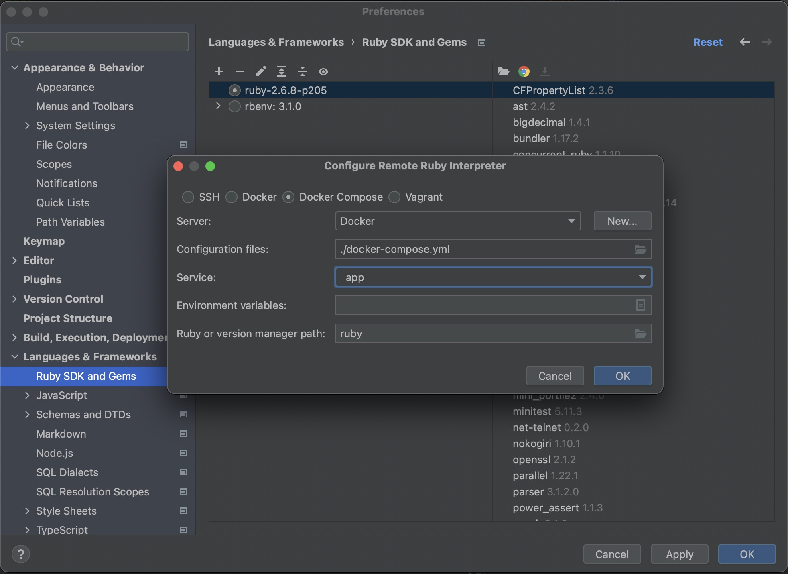
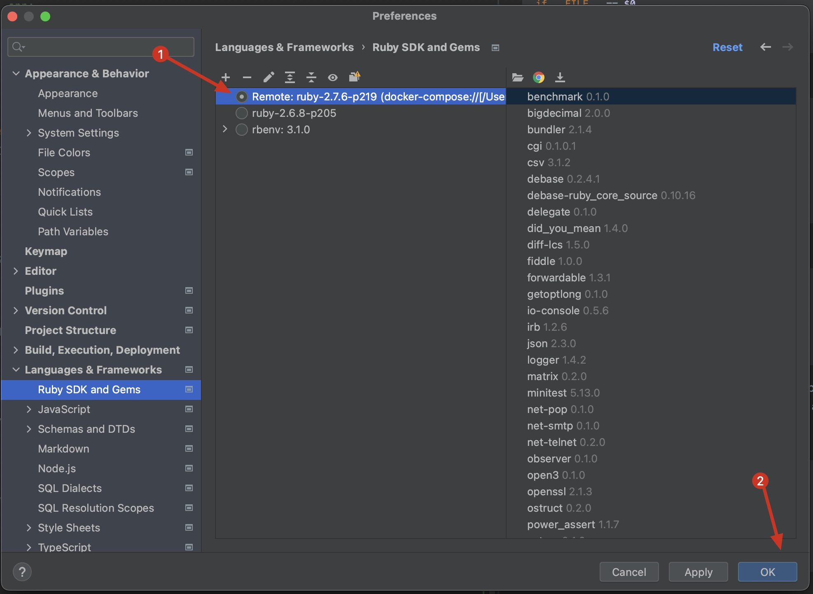
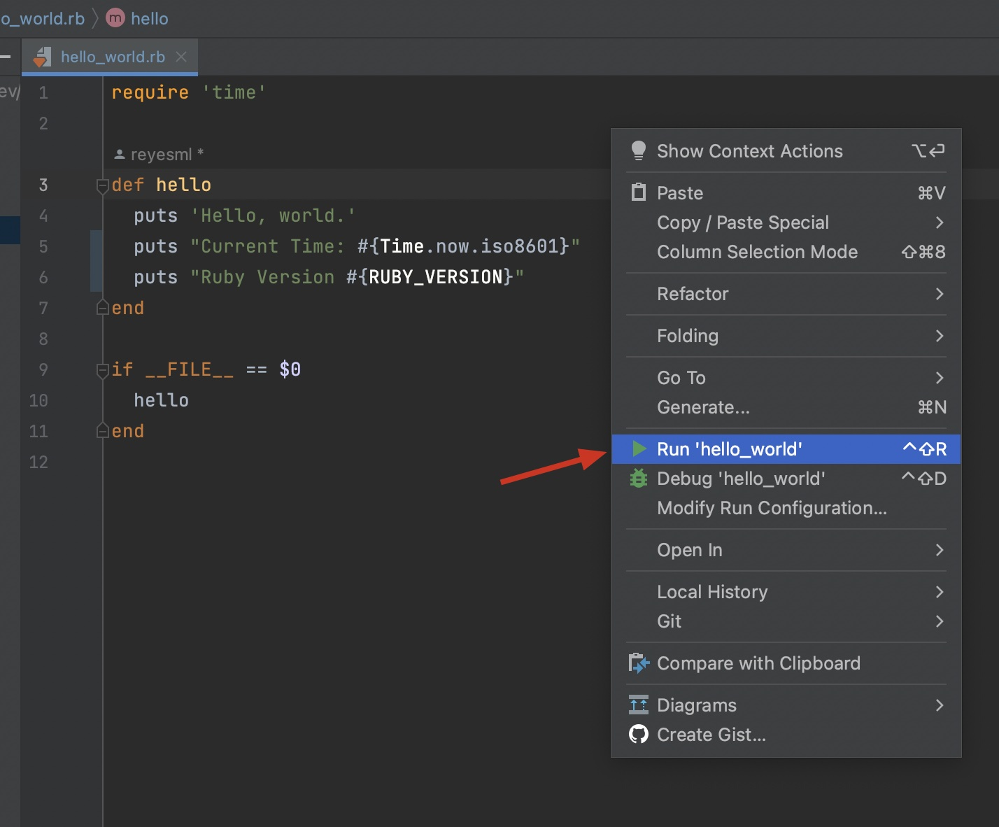
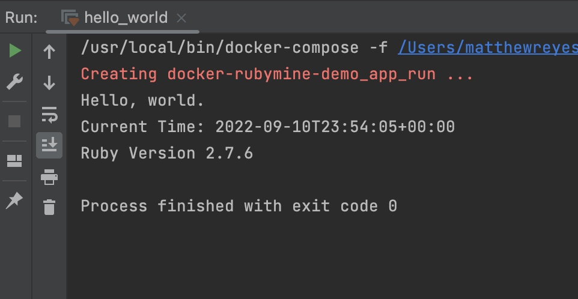
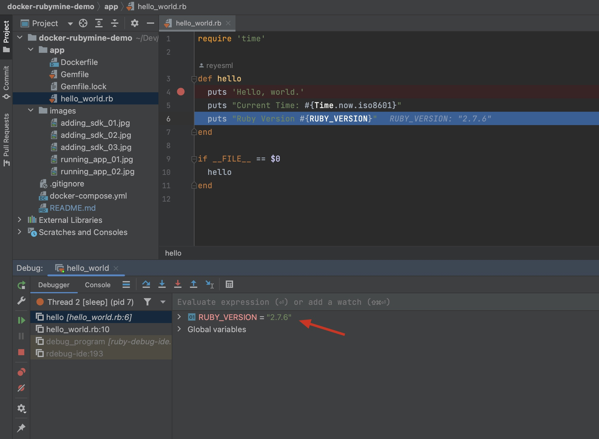
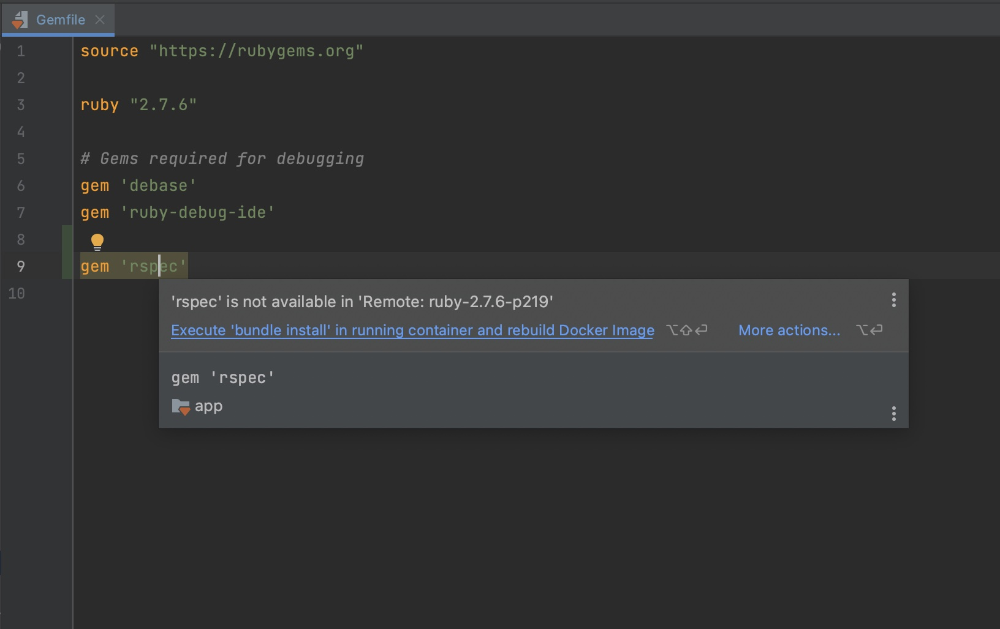
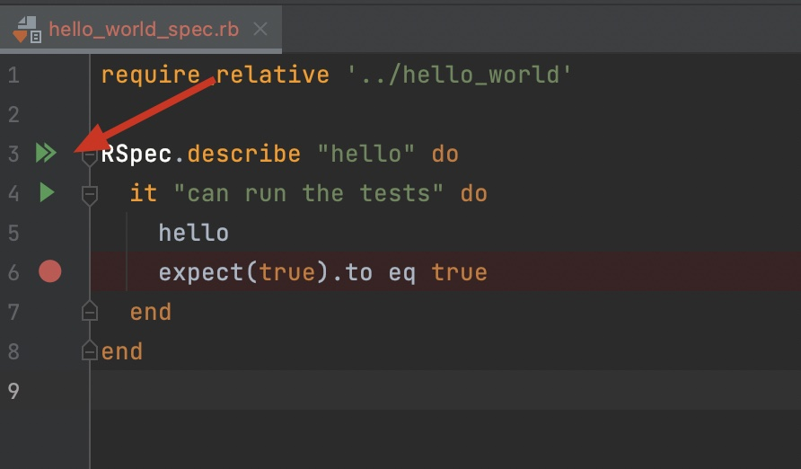
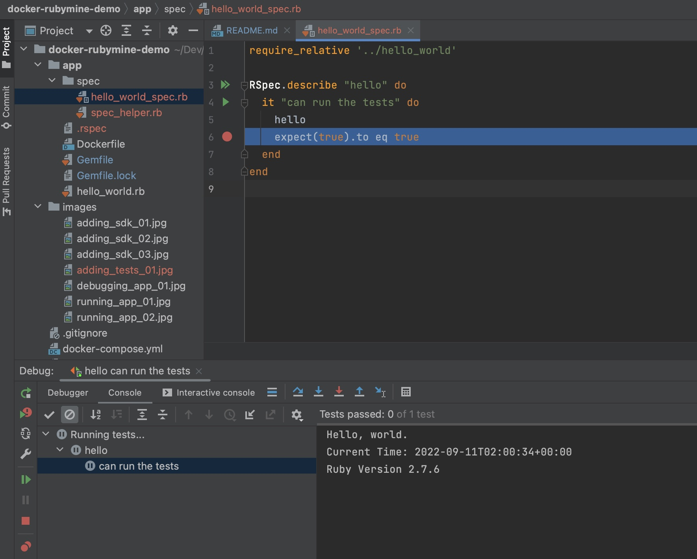

# Developing with Docker and RubyMine

The purpose of this project is to provide an introduction to developing using Docker and RubyMine.  In this tutorial we will:

* Create a container for a "Hello, world." Ruby app
* Configure that container as a remote SDK in RubyMine
* Run and Debug the app within the container
* Update/Install gems in the remote SDK

**Why?** Using containers for development **saves time**.  Containers can:

* Reduce the time-to-first-commit for new project contributors by allowing them to bypass a major portion of environment setup
* Eliminate entire classes of issues by providing consistency across environments
* Allow engineers to quickly experiment with new platforms/technologies without jeopardizing their development environment


Some prerequisites:
* Working knowledge of Ruby and RubyMine :thumbsup:
* Cursory knowledge of Docker and containers :ok_hand:
* [RubyMine](https://www.jetbrains.com/ruby/) _(tested with 2022.2.1)_
* [Docker](https://www.docker.com/) _(tested with 20.10.16)_


## [Prepping our app](https://github.com/reyesml/docker-rubymine-demo/commit/6cc7b90978b020477b920119111b317b204988d4)

Start by creating a new, empty project in RubyMine.  Next, create an `app/` directory in the project root, and the following files:

`app/hello_world.rb`:
```ruby
require 'time'

def hello
  puts 'Hello, world.'
  puts "Current Time: #{Time.now.iso8601}"
  puts "Ruby Version #{RUBY_VERSION}"
end

if __FILE__ == $0
  hello
end
```


`app/Gemfile`:
```ruby
source "https://rubygems.org"

ruby "2.7.6"

# Gems required for debugging
gem 'debase'
gem 'ruby-debug-ide'
```

`app/Dockerfile`:
```dockerfile
FROM ruby:2.7.6-buster
WORKDIR /usr/src/app
COPY . .
RUN bundle install
CMD ["ruby", "hello_world.rb"]
```

Next, let's set up a docker-compose file in our project root.  The docker-compose file will instruct docker to build an image from the `app/Dockerfile`, and mount our `app/` directory as a [volume](https://docs.docker.com/storage/volumes/) in the container.

`docker-compose.yml`:
```
version: "3.9"
services:
  app:
    build: ./app
    volumes:
      - ./app:/usr/src/app
```


## [Configure Docker-Compose as our Remote SDK](https://github.com/reyesml/docker-rubymine-demo/commit/8f1f34bdd388562c1b71ebd1ef286c25fef841ac)
In RubyMine, go to `prefernces > languages & frameworks > ruby sdk & gems`, and add our docker-compose file as the source for a new remote interpreter:






Once the Remote SDK has been configured, you should notice that a `app/Gemfile.lock` file was generated.  This is due to the `RUN bundle install` specified in our `app/Dockerfile`, and because we've mounted `app/` as a volume within our container using Docker Compose.


## [Running and Debugging the App](https://github.com/reyesml/docker-rubymine-demo/commit/19f8d746e46cb28d1b36d75f01685ef891f68995)

Now that we've configured docker-compose as our remote SDK, we should be able to run our app from the IDE.  Open the `app/hello_world.rb` file in the RubyMine editor.  Right-click anywhere in that file, and select "run":



You should receive output similar to the screenshot below.



Notice the Ruby version in the screeshot above.  It should match the version specified in the`app/Dockerfile`.  If it doesn't match (or the app doesn't run), double-check that the remote sdk is selected within the "Ruby SDK and Gems" preferences.

You should also be able to set a breakpoint and debug your app using the Remote SDK.  Again, the RUBY_VERSION in the debugging output should match the version specified in our `app/Dockerfile`:




## [Adding Tests](https://github.com/reyesml/docker-rubymine-demo/commit/65ba4844b0355220a0db607140a5247adbe5ff98)

Let's setup [rspec](https://rspec.info/) to our project.  First, we need to add `gem 'rspec'` to our `app/Gemfile` :

```ruby
source "https://rubygems.org"

ruby "2.7.6"

# Gems required for debugging
gem 'debase'
gem 'ruby-debug-ide'

gem 'rspec'
```

Next, we'll run `bundle install` against our remote SDK.  To do this, open the Gemfile in RubyMine, hover over the rspec gem, and select "Execute 'bundle install' in running container and rebuild Docker Image":



_Note: Running `bundle install` via different means may not install the gems in the container referenced by the Remote SDK.  This results in a loss of intellisense for newly added gems._

Once the bundle install has finished, open a terminal in the root of the project, then run:

`docker compose run --rm app rspec --init`

You should see new `app/.rspec` and `app/spec/spec_helper.rb` files added to the repository.

Next, let's add a simple test:

`app/rspec/hello_world_spec.rb`:
```ruby
require_relative '../hello_world'

RSpec.describe "hello" do
  it "can run the tests" do
    hello
    expect(true).to eq true
  end
end
```

If you open `app/rspec/hello_world_spec.rb` in rubymine, you should be able to run and debug the application using the gutters of the test file:





Notice again how the ruby version matches the version specified in our Dockerfile.


## Woo Hoo!

If you made it this far, congratulations! I hope you found this a helpful introduction to developing with Docker and RubyMine.  If you notice any areas of this guide that could use some love, PR's are always welcome :heart:

